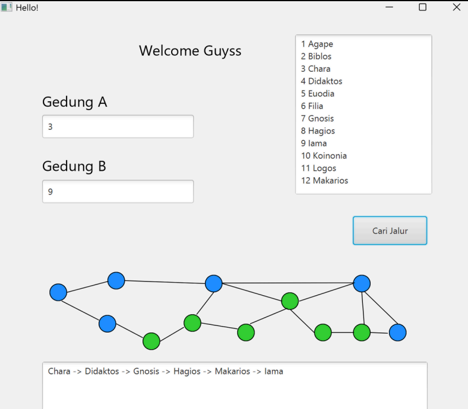

# Campus Navigation with Dijkstra and A*

A campus navigation application that finds the shortest route between locations inside the university using two pathfinding algorithms:

- Dijkstra Algorithm
- A* (A-Star) Algorithm

## Team Members

| NIM | Name |
|------|------|
| 71230985 | Tomas Becket |
| 71231002 | Philip Deric Kho |
| 71231015 | Karel Marley Bala Bakior |
| 71231017 | Paulus Ungirwalu |
| 71231061 | Syendhi Reswara S. |

## Features

- Search shortest route between campus locations
- Graph-based route representation
- Interactive graphical interface
- Distance calculation between nodes

## Screenshot

## Algorithms

### Dijkstra

Dijkstra explores nodes based on the smallest accumulated distance from the starting point and guarantees the shortest path.

### A*

A* combines path cost and heuristic estimation to guide the search toward the destination more efficiently.

Evaluation function:

\[
f(n) = g(n) + h(n)
\]

where:

- `g(n)` = distance from start node
- `h(n)` = estimated distance to destination

## Technologies Used

- Java
- C++
- Graph Theory
- Dijkstra Algorithm
- A* Search Algorithm

> 21/02/2025
